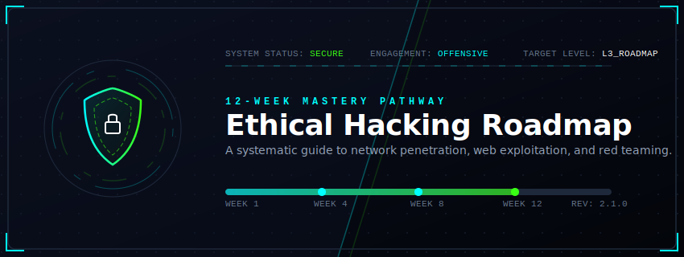
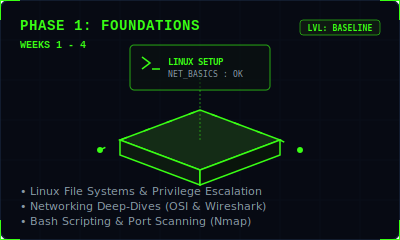
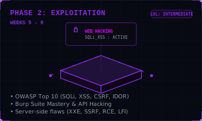
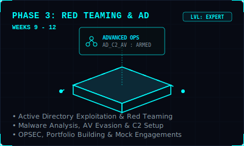

# Ethical Hacking Roadmap

  

---

## ⚡ Interactive Phase Overview

Explore the three phases of this roadmap. Each phase builds upon the previous one to transition you from a complete beginner to an advanced offensive operator.

<table align="center" style="border: none; border-collapse: collapse; background: transparent; width: 100%;">
  <tr style="border: none; background: transparent;">
    <td align="center" style="border: none; padding: 10px; width: 33.3%;">
      
    </td>
    <td align="center" style="border: none; padding: 10px; width: 33.3%;">
      
    </td>
    <td align="center" style="border: none; padding: 10px; width: 33.3%;">
      
    </td>
  </tr>
</table>

---

## 🎯 Roadmap Philosophy & Daily Routine

This program is designed for dedication and consistency. Mastery isn't built overnight, but through structured daily habits.

### ⏱️ Recommended Daily Routine
*   **📚 Theory & Research (1–2 Hours):** Study protocols, methodologies, and concepts.
*   **💻 Hands-on Labs (1–2 Hours):** Apply what you've learned on TryHackMe, PortSwigger, or local VM environments.
*   **📝 Revision & Notes (30 Minutes):** Update your personal gitbook, obsidian notes, or markdown repository.
*   **👥 Community & Writeups (15 Minutes):** Read community writeups, dissect blog posts, and share your learnings.

---

## 🚀 The 12-Week Curriculum

📂 <b>Phase 1: Foundations (Weeks 1–4)</b>

 

> Focuses on operating system fundamentals, networking baselines, and scanning fundamentals.

### 📁 Week 1: Environment Setup & Network Baselines
*   **Monday:** Introduction (What is Ethical Hacking? Types of Hackers, Cyber Kill Chain, Lab Setup Overview)
*   **Tuesday:** Kali Linux Basics (Kali Overview, Installation, Update & Upgrade, Basic Shell Commands)
*   **Wednesday:** Linux Fundamentals (File System Hierarchy, Permissions, Users & Groups, File Operations)
*   **Thursday:** Linux Networking (IP Addressing, interface utilities `ifconfig` / `ip a`, Ping, Traceroute, `netstat`, `ss`)
*   **Friday:** Networking Basics (OSI Model, TCP/IP Model, Ports & Protocols, Common Services)
*   **Saturday:** Kali Tools Intro (Tool Categories, `kali --help`, Updating Tools, Favorites Setup)
*   **Sunday:** *Practice Day* (Explore Kali, Practice Commands, Solve Basic Linux Rooms, Document Learnings)

### 📁 Week 2: Scripting, Wireshark & Web Basics
*   **Monday:** Bash Scripting Basics (What is Bash? Variables, Operators, `echo` & `read`)
*   **Tuesday:** Bash Scripting Advanced (If-Else conditions, Loops `for`/`while`, Functions, scripting simple scanners)
*   **Wednesday:** Networking Deep Dive (Subnetting Basics, CIDR Notation, Private vs Public IP, Subnet Calculator)
*   **Thursday:** Wireshark Basics (Installation, Interface Overview, Capturing Packets, Analyzing HTTP vs HTTPS traffic)
*   **Friday:** Web Basics (How Websites Work, HTTP/HTTPS headers, Domains & DNS, Web Tech Stack)
*   **Saturday:** TryHackMe Intro (THM Platform Overview, Account Setup, Navigating Rooms, Complete first basic room)
*   **Sunday:** *Practice Day* (Solve Wireshark and Network rooms, Revise Bash scripting syntax, Track Progress)

### 📁 Week 3: PrivEsc, Services & Scanning
*   **Monday:** Linux Privileges (Understanding `sudo`, `su`, SUID/SGID permissions, Sticky Bit basics)
*   **Tuesday:** Linux Services (Systemctl Basics, Start / Stop services, Enable / Disable, Check service status)
*   **Wednesday:** Firewall Basics (What is a Firewall? `ufw` basics, Allow / Deny Rules, Port Filtering)
*   **Thursday:** Enumeration Basics (Active vs Passive Enumeration, Banner Grabbing, Service Discovery concepts)
*   **Friday:** Nmap Basics (Nmap Installation, Scan Types: SYN scan, TCP Connect, UDP Scan, Nmap Scripting Engine - NSE)
*   **Saturday:** Hands-on Nmap (Host Discovery, Port Scanning, Service Version Detection, OS Fingerprinting)
*   **Sunday:** *Practice Day* (Complete Nmap rooms on THM, build cheat sheet, document scan flags)

### 📁 Week 4: Multi-Protocol Enumeration & Vulnerability Basics
*   **Monday:** Web Enumeration (What to look for, Directory Bruteforcing, Robots.txt, using Wappalyzer)
*   **Tuesday:** DNS Enumeration (DNS Records overview, queries using `nslookup` & `dig`, Subdomain Enumeration)
*   **Wednesday:** SMB Enumeration (What is SMB? `smbclient` utility, `enum4linux`, extracting Users & Shares)
*   **Thursday:** FTP Enumeration (FTP Basics, testing Anonymous Logins, List Files, FTP clients)
*   **Friday:** Vulnerability Basics (Introduction to Vulnerabilities, CVE Basics, Severity Metrics - CVSS, Real World Examples)
*   **Saturday:** THM Practice (Complete targeted protocol enumeration rooms, Capture flags, read writeups)
*   **Sunday:** **Mini Project Day** (Choose a local lab/target machine, perform complete enumeration, document findings, write a professional report)

 

📂 <b>Phase 2: Web Hacking & Exploitation (Weeks 5–8)</b>

 

> Transitioning into web application vulnerabilities, testing proxies, and exploitation mechanisms.

### 📁 Week 5: Web Architecture & SQL Injection Basics
*   **Monday:** Web Fundamentals Refresher (HTTP/HTTPS client-server cycle, Cookies & Sessions, HTTP methods)
*   **Tuesday:** Burp Suite Basics (Burp Suite Overview, Proxy Setup, Intercepting & Forwarding, Repeater & Decoder)
*   **Wednesday:** Information Disclosure (Directory Listing flaws, sensitive backup files, source code analysis)
*   **Thursday:** Authentication Mechanisms (Login processes, Session Management, Cookies, Tokens, Common Auth Flaws)
*   **Friday:** SQL Injection Intro (What is SQLi? Testing input fields, Login bypass forms, Error-Based SQLi)
*   **Saturday:** SQL Injection Advanced (UNION Exploitation, Blind SQLi - Boolean, Blind SQLi - Time-Based)
*   **Sunday:** *Practice Day* (Perform PortSwigger SQLi labs, document exploit payloads, write notes)

### 📁 Week 6: Web Vulnerabilities (Client-Side & Advanced)
*   **Monday:** SQL Injection Labs (Practice on DVWA / Mutillidae / PortSwigger, Capture flags, structure writeups)
*   **Tuesday:** Cross-Site Scripting (XSS) Basics (What is XSS? Types of XSS: Reflected and Stored XSS)
*   **Wednesday:** XSS Advanced (DOM-based XSS, Bypassing Filters, XSS in the wild, payloads customization)
*   **Thursday:** XSS Labs (Solve practical XSS challenges, capture flags, learn payload delivery)
*   **Friday:** CSRF Basics (Cross-Site Request Forgery concept, how it works, impact, basic POC exploit)
*   **Saturday:** CSRF Protection Bypass (Token bypassing, SameSite Cookie restrictions, Real-world bypass techniques)
*   **Sunday:** *Practice Day* (Complete XSS and CSRF labs on PortSwigger/THM, update payload repository)

### 📁 Week 7: Server-Side Exploitation & Access Control
*   **Monday:** File Inclusion Vulnerabilities (Local File Inclusion - LFI, Remote File Inclusion - RFI, Path Traversal)
*   **Tuesday:** Command Injection (Command Injection mechanics, basic OS commands injection, escaping input filters)
*   **Wednesday:** XXE & SSRF Basics (XML External Entity, Server-Side Request Forgery, impact, basic exploitation payloads)
*   **Thursday:** Labs Day (Pick any 2 topics from this week, solve related PortSwigger/THM rooms, capture flags)
*   **Friday:** Broken Access Control (Horizontal Privilege Escalation, Vertical Privilege Escalation, Lab Walkthroughs)
*   **Saturday:** IDOR (Insecure Direct Object Reference concept, IDOR in real world, locating and exploiting IDOR parameter tampering)
*   **Sunday:** *Practice Day* (Combine server-side techniques in complex labs, write notes, track progress)

### 📁 Week 8: APIs, Security Misconfigs & Metasploit
*   **Monday:** Security Misconfigurations (Default credentials, unused pages, sensitive data leaks, misconfigured headers)
*   **Tuesday:** API Hacking Basics (What is an API? REST & JSON structure, API Reconnaissance, using Postman)
*   **Wednesday:** API Testing (Authentication bypass in APIs, IDOR in API endpoints, Mass Assignment, Rate Limit bypass)
*   **Thursday:** API Labs (Solve practical API rooms, capture flags, document endpoints)
*   **Friday:** Exploitation Basics (What is exploitation? Vulnerability chaining, finding exploits, utilizing Exploit-DB)
*   **Saturday:** Metasploit Essentials (Metasploit overview, Modules: Exploit/Payload/Encoder, using `msfconsole`, basic exploitation)
*   **Sunday:** **Phase 2 Recap Project** (Set up DVWA/OWASP Juice Shop, locate 3 distinct web flaws, write exploit writeups)

 

📂 <b>Phase 3: Advanced Operations & Red Teaming (Weeks 9–12)</b>

 

> Diving into Active Directory environments, red teaming methodologies, malware analysis, and professional reporting.

### 📁 Week 9: Active Directory (AD) & Red Teaming Basics
*   **Monday:** Red Teaming Fundamentals (What is Red Teaming? Kill Chain, MITRE ATT&CK Framework, attack simulation concepts)
*   **Tuesday:** TryHackMe Day (Complete dedicated Red Team intro rooms, capture flags)
*   **Wednesday:** Active Directory Intro (AD Architecture, Domains & Forests, Users, Groups, OUs, Lab AD Setup)
*   **Thursday:** AD Enumeration (User enumeration, Share enumeration, using BloodHound to map attack paths)
*   **Friday:** AD Attacks - Initial Access (Password spraying, AS-REP Roasting, Kerberoasting)
*   **Saturday:** AD Privilege Escalation & Lateral Movement (Unconstrained delegation, DCSync attack, Pass-the-Hash, Pass-the-Ticket, WMI/WinRM)
*   **Sunday:** *Practice Day* (Refine AD attacks in lab environments, review BloodHound graphs, document paths)

### 📁 Week 10: Malware Analysis & Evasion
*   **Monday:** Malware Basics (Types of Malware, Static vs Dynamic analysis concepts, tools: Ghidra, PEview, VirusTotal)
*   **Tuesday:** Malware Analysis Static (File structure, identifying strings & imports, detecting Indicators of Compromise - IOCs)
*   **Wednesday:** Malware Analysis Dynamic (Sandbox analysis, monitoring system/network behavior, registry tracking)
*   **Thursday:** Web Shells & C2 (Web Shell types, C2 Frameworks like Covenant/Sliver, establishing reverse shell connections)
*   **Friday:** Evasion Techniques (Antivirus Evasion Basics, Obfuscation, Encoding payloads, using Packers)
*   **Saturday:** Practice Day (Analyze basic malware samples in isolated labs, document signatures)
*   **Sunday:** Bug Bounty Introduction (Bug Bounty workflow, finding programs, understanding scopes & rules, platform setups)

### 📁 Week 11: OSINT, Methodologies & Burp Suite Mastery
*   **Monday:** Reconnaissance & OSINT (Passive recon, OSINT techniques, Subdomain harvesting with `theharvester`, `amass`)
*   **Tuesday:** Web Testing Methodology (Information gathering, vulnerability mapping, manual testing flow in enterprise apps)
*   **Wednesday:** Reporting Bugs (Writing professional bug reports, writing Clear Steps to Reproduce, PoC creation, Screenshots)
*   **Thursday:** Burp Suite Mastery (Burp Suite Advanced Repeater, Intruder Cluster Bomb, Sequencer analysis)
*   **Friday:** Rate Limiting Bypass & Tricks (Bypass techniques, parameter pollution, locating hidden params in labs)
*   **Saturday:** CTF Day (Solve challenging CTF boxes focusing on web and privilege escalation, writeups creation)
*   **Sunday:** *Practice Day* (Solve intermediate labs, review weak areas, update portfolio)

### 📁 Week 12: Advanced Operations & Final Mock Engagement
*   **Monday:** Advanced Exploitation (Understanding Buffer Overflows, ROP basics, Heap exploitation concepts)
*   **Tuesday:** Pivoting & Tunneling (Port forwarding, SSH tunneling, advanced pivoting with Chisel/Ligolo in multi-hop networks)
*   **Wednesday:** Post-Exploitation (System enumeration, Credential dumping, data looting in target networks)
*   **Thursday:** OPSEC & Anti-Forensics (OPSEC Principles, clearing Event Logs, anti-forensics basics)
*   **Friday:** Portfolio Building (Creating a professional cybersecurity GitHub profile, documenting writeups, structuring resumes)
*   **Saturday:** **Mock Engagement** (Complete attack simulation on a multi-machine network: compromise network, pivot, capture flags, document)
*   **Sunday:** **Program Review** (Identify key learnings, analyze mistakes, plan advanced cert prep like OSCP/PNPT)

---

## 🛠️ Essential Platforms & Resources

*   **TryHackMe** — Hands-on labs from beginner to advanced. Excellent for AD and basic web exploitation.
*   **Hack The Box** — Advanced network environments and realistic CTF challenges.
*   **PortSwigger Web Security Academy** — The gold standard for web application security labs.
*   **OverTheWire** — Interactive terminal commands practice (highly recommended for Weeks 1 & 2).
*   **BloodHound** — Used to visualize Active Directory relationships and execute pathfinder-based attacks.

---

## 🛡️ Golden Rules for Hacking
1.  **Always Get Permission:** Never perform scans or exploitation on systems you do not own or do not have explicit written consent to test.
2.  **Stay Documented:** Taking high-quality screenshots and command output records is what separates script kiddies from security professionals.
3.  **Break Things, Then Fix Them:** Knowing how to secure a vulnerability is just as important as knowing how to exploit it.